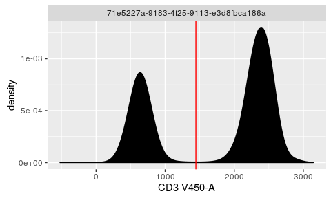
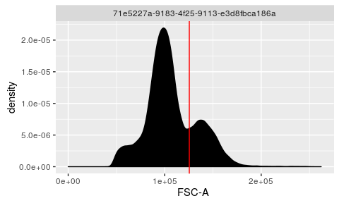
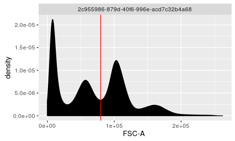
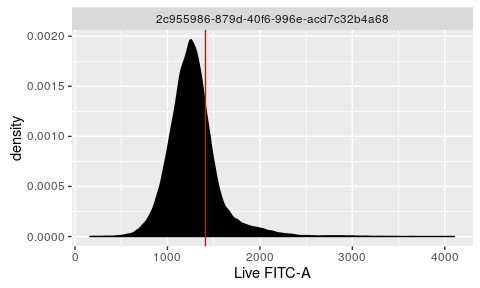
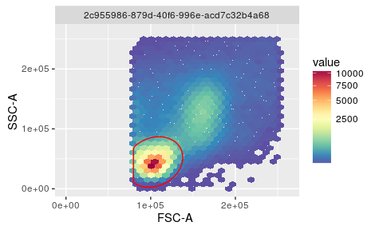

# OpenCyto: How to use different auto gating functions
Mike Jiang  


Here we will illustrate how to choose and use the appropriate gating functions that are natively provided by `openCyto` package. Apparently users can always define develop their own `gating` algorithms and use them as the `plugin` functions in `openCyto` framework, which are beyond the scope of this document.


```r
library(openCyto)
library(ggcyto)
gs <- load_gslist("~/rglab/workspace/analysis/Lyoplate_new/output/gated_data/auto/gslist-bcell")
```
## 1D gating methods
### `mindensity`
The name of this gating function is self-explaining, that is to find the minimum as the cutpoint between negative and postive peaks in 1d density plot. It is fast,robust and extremely easy to use especially when there is a good separation between `+` and `-` populations/peaks.

For example, it is usually easy to gate on `CD3` channel and no need to supply any arguments to the method.


```r
fr <- getData(gs[[1]], "Live")
chnl <- "CD3"
g <- mindensity(fr, channel = chnl)
autoplot(fr, chnl) + geom_gate(g)
```



However, it may need some extra guidance when there are more than `2` major peaks/populations detected in densit profile.

```r
fr <- getData(gs[[1]], "boundary")
chnl <- "FSC-A"
g <- mindensity(fr, channel = chnl)
mylimits <- ggcyto_par_set(limits = "instrument")
p <- autoplot(fr, chnl) + mylimits
p + geom_gate(g)
```


Here we actually want to cut between the `2nd` and `3rd` peaks to remove the `debris cells` that are below that cut point. So we want to specify a `range` that will limit the cut point. And sometime it is also helpful to fine-tune the `kernal density`  smooth factor `adjust` to optimize the density estimation according to your data. `openCyto` uses a default value `2`, here we decreases it to `1.5` in this particular case.


```r
g <- mindensity(fr, channel = "FSC-A", gate_range=c(5e4,1e5), adjust = 1.5)
p + geom_gate(g)
```



Alternatively you can achieve the same effect by setting `min` or `max` to pre-filter the data before the `mindenstiy` works on it.

```r
g <- mindensity(fr, channel = "FSC-A", min = 2e4)
p + geom_gate(g)
```


To determine choosing one way or the other or combining both is highly dependent on how your data varies across samples. The more contrains yields more accuracy yet at cost of robustness of the gating method.


### `tailgate`
This gating method is used in the senarios where there is only one major peak detected thus automatically disqualify the usage of `mindensity`. `tol` is to control how far the cut point should be placed away from the peak. 


```r
fr <- getData(gs[[1]], "lymph")
chnl <- "Live"
g <- tailgate(fr, channel = chnl, tol = 5e-2)
p <- autoplot(fr, chnl) + mylimits
p + geom_gate(g)
```



This gating method is more commonly used in gating the `rare` populations when the target population is not prominent enough to stand out as the second peak. (e.g. `cytokine` gates in `ICS` assays.)

## 2D gating methods
### `flowClust`
`flowClust` package in itself is not limited to 2-dimensional gating. But here we are talking about a dedicated wrapper function `.flowClust.2d` from `openCyto` package that leverages `flowClust` clustering engine to work on `2D` cases specifically. You won't need to write the full name of the function in `csv` gating template, simply put `flowClust` in the `gating_method` column, and then the template parser will automatically dispatch to the right function.


```r
fr <- getData(gs[[1]], "nonDebris")
chnl <- c("FSC-A", "SSC-A")
g <- openCyto:::.flowClust.2d(fr, channels = chnl, K=2, target=c(1e5,5e4), quantile=0.95, pp_res = NULL)
p <- autoplot(fr, x = chnl[1], y = chnl[2]) + mylimits
p + geom_gate(g)
```



`K` is to tell the algorithm how many major clusters/populations are expected in the 2d profile. `target` specify the mean/center of the target population to get, which doesn't have to be precise. If not supplied, flowClust will pick the most prominent cluster as the target, which would be the right choice in most cases.
`quantile` specify how large the `ellipse` should be. `pp_res` is used to provide the `prior` information for `flowClust`. (More details are in `?flowClust`)


